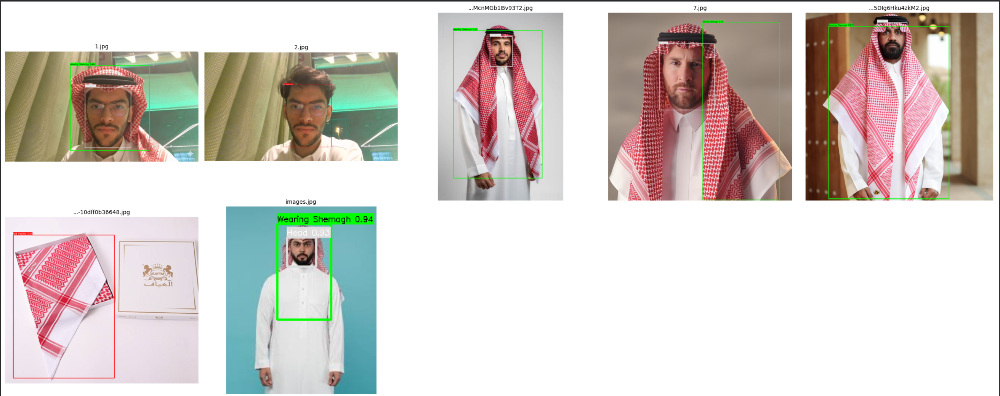
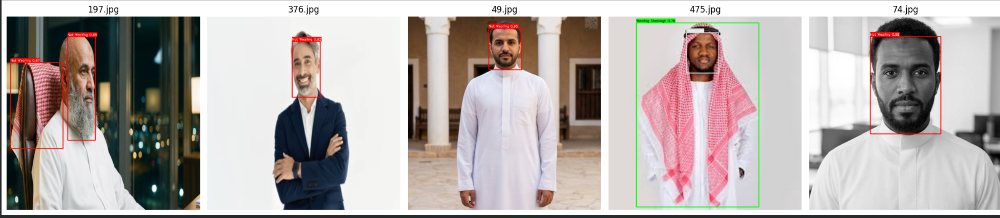

# 
 Shemagh Compliance Detection System

## 📌 Overview

This project presents a computer vision–based compliance detection system designed to determine whether a person is **wearing a Shemagh**.

The system is built using a custom-trained YOLO model enhanced with intelligent post-processing logic to improve classification reliability.

The solution combines:

- Head detection  
- Shemagh detection  
- Custom Non-Maximum Suppression (NMS)  
- Coverage-based reclassification logic  

---

## 🧠 System Architecture

### 1️⃣ Object Detection

The YOLO model predicts bounding boxes for three classes:

- **Class 0** → Head  
- **Class 1** → Wearing Shemagh  
- **Class 2** → Not Wearing  

---

### 2️⃣ Custom Shemagh NMS

A specialized Non-Maximum Suppression procedure is applied only to shemagh detections to remove overlapping duplicate predictions and retain the highest-confidence bounding boxes.

---

### 3️⃣ Smart Coverage-Based Reclassification

To ensure robust compliance detection, the system computes head coverage using:

$$
\text{Coverage} = \frac{\text{Intersection Area}}{\text{Head Area}}
$$

If the shemagh covers more than a defined threshold of the detected head region (default: 70%), the head is classified as:

- ✅ **Wearing Shemagh**
- ❌ **Not Wearing**

This logic reduces false positives caused by partial or misaligned detections.

---

## 🎯 Output Labels

| Label | Meaning |
|-------|----------|
| Head | Detected head region |
| Wearing Shemagh | Head sufficiently covered |
| Not Wearing | Head without required coverage |

---

## ⚙️ Key Parameters

| Parameter | Default Value | Description |
|------------|--------------|------------|
| `conf` | 0.1 | Detection confidence threshold |
| `iou` | 0.20 | IoU threshold for YOLO predictions |
| `coverage_threshold` | 0.5 | Minimum required head coverage ratio |

---

## 🏗️ Core Features

- YOLO-based detection backbone  
- Spatial reasoning between detected objects  
- Custom compliance validation logic  
- Overlap-aware bounding box refinement  
- Clean visualization with color-coded labeling  
- Modular and extensible architecture  

---

## 🔬 Design Motivation

Pure object detection is often insufficient for compliance tasks.  
This system enhances robustness by incorporating spatial reasoning between detected objects (head and shemagh), rather than relying solely on predicted class labels.

This hybrid approach improves reliability in real-world deployment scenarios.

---

## 📚 Technology Stack

- Python  
- Ultralytics YOLO  
- OpenCV  
- NumPy  
- PyTorch  

---
## 🖼️ Examples

